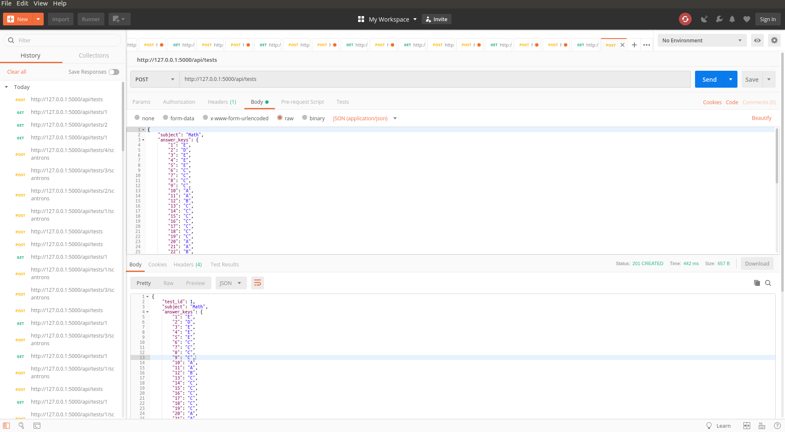
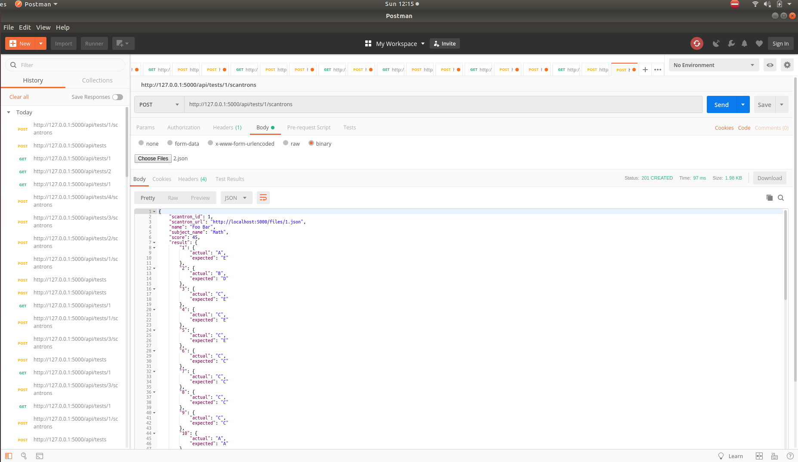
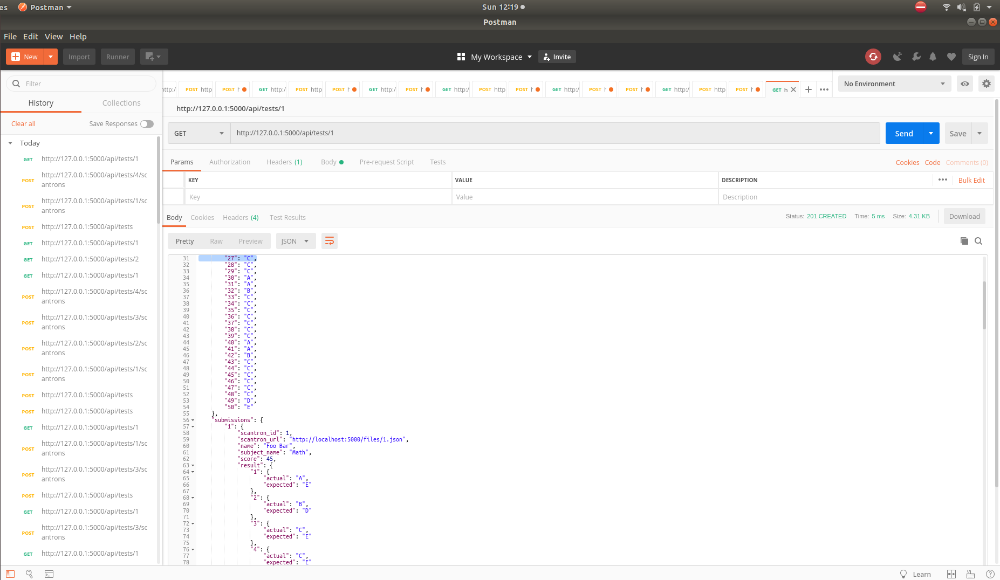

# cmpe273-assignment2

This scantron application supports for test subject details submission and scantron submission. It calculates score by comparing subject answer keys with scantron answers and update scores.
It supports below main functionalities

* Scantron submission
* Format validation
* Save scantron file on server for future references
* Score calculation against answer keys
* Score reporting

# How to run

```sh
$ env FLASK_APP=app.py flask run
```

All the above features will be handled via a set of REST APIs. The application will persist data into a local SQLite DB.

# APIs

## Create a test

_Request_

> POST http://localhost:5000/api/tests

_Postman screenshot_


## Upload a scantron
JSON_SCANTRON_FILE (sample files included in repo)
_Request_

> POST http://localhost:5000/api/tests/1/scantrons

_Postman screenshot_



## Check all scantron submissions

_Request_

> GET http://localhost:5000/api/tests/1

_Postman screenshot_



